# Non-sematic version graph ideas

This is to handle Maven suckiness.

## Direct

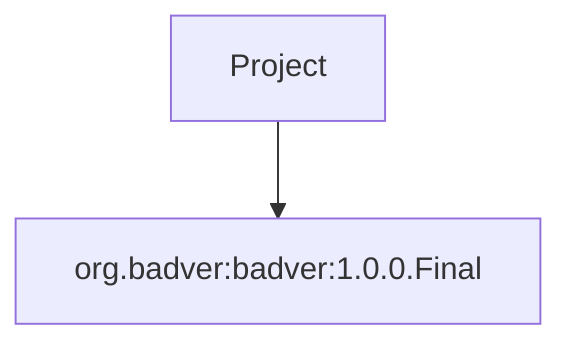

If the project defines the versions in a mapping section, it can be used for the traversal:

```groovy
project() {
  semanticVersions {
    mapping(id: "org.badver:badver-direct:1.0.0.Final", version: "1.0.0")
  }

  dependencies {
    group(type: "compile") {
      dependency(id: "org.badver:badver-direct:1.0.0")
    }
  }
}
```

## Transitive

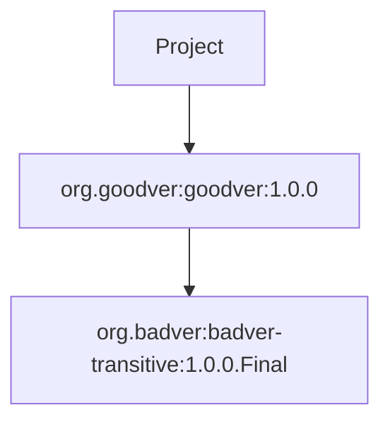

The project needs a place to store transitive version mappings:

```groovy
project() {
  semanticVersions {
    mapping(id: "org.badver:badver-transitive:1.0.0.Final", version: "1.0.0")
  }
  
  dependencies {
    group(type: "compile") {
      dependency(id: "org.goodver:goodver:1.0.0")
    }
  }
}
```

The AMD file for `goodver` needs to look like this:

```xml
<artifactMetaData>
  <dependencies>
    <dependency-group name="compile">
      <dependency group="org.badver" project="badver" name="badver" version="1.0.0.Final" type="jar"/>
    </dependency-group>
  </dependencies>
</artifactMetaData>
```

The version is not semantic, but it does not force the `goodver` project's semantic version choice on the current project. When we resolve, we will store the bad version in the `nonSemanticVersion` member field and then use the mapping to figure out the semantic version for the current project.

## Direct w/ transitives

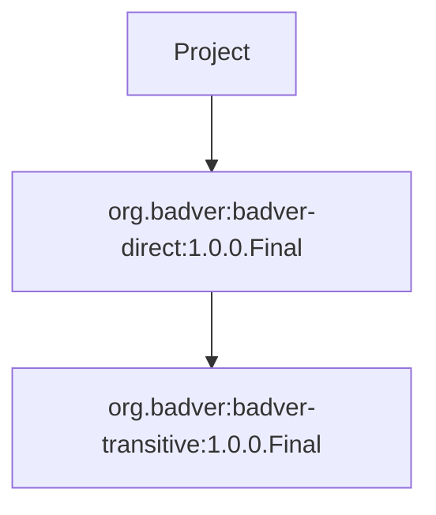

```groovy
project() {
  semanticVersions {
    mapping(id: "org.badver:badver-direct:1.0.0.Final", version: "1.0.0")
    mapping(id: "org.badver:badver-transitive:1.0.0.Final", version: "1.0.0")
  }
  
  dependencies {
    group(type: "compile") {
      dependency(id: "org.badver:badver:1.0.0")
    }
  }
}
```

## Traversal idea

During traversal, if we store the good and bad versions on the Artifact, we can use that to fetch the POM and the artifact itself. It would look like this:

### Project build file

```groovy
project() {
  semanticVersions {
    mapping(id: "org.badver:badver-direct:1.0.0.Final", version: "1.0.0")
    mapping(id: "org.badver:badver-transitive:1.0.0.Final", version: "1.0.0")
  }
  
  dependencies {
    group(type: "compile") {
      dependency(id: "org.badver:badver-direct:1.0.0")
      dependency(id: "org.goodver:goodver:1.0.0")
    }
  }
}
```

### Graph build

#### Step 1

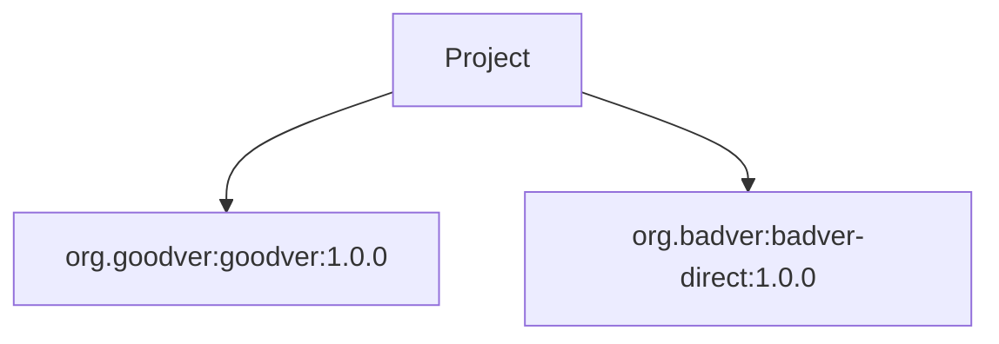

#### Step 2

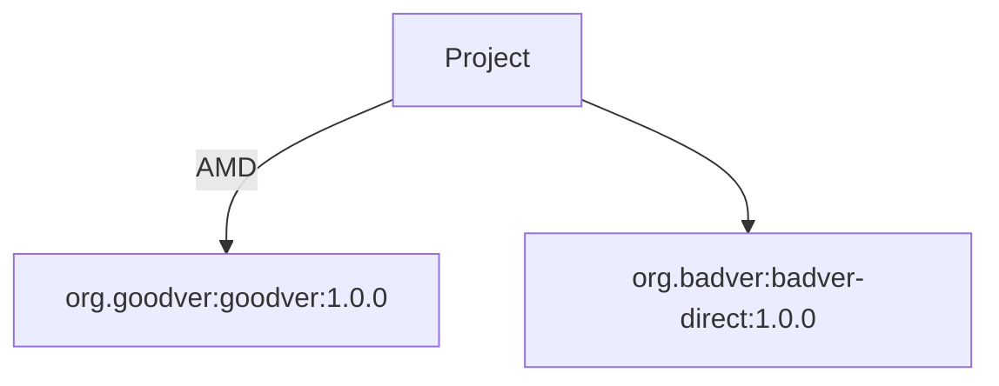

#### Step 3


#### Step 4

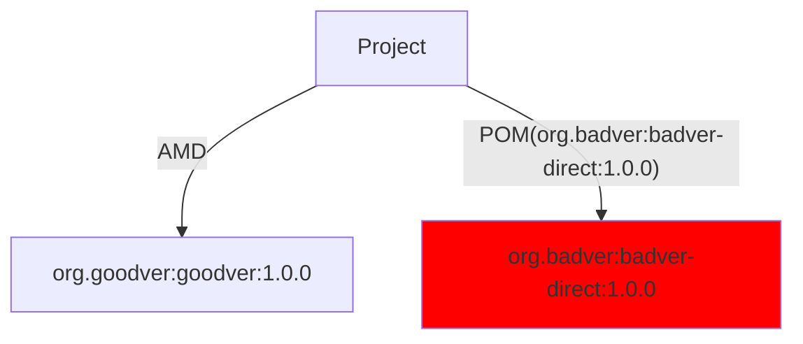

#### Step 5

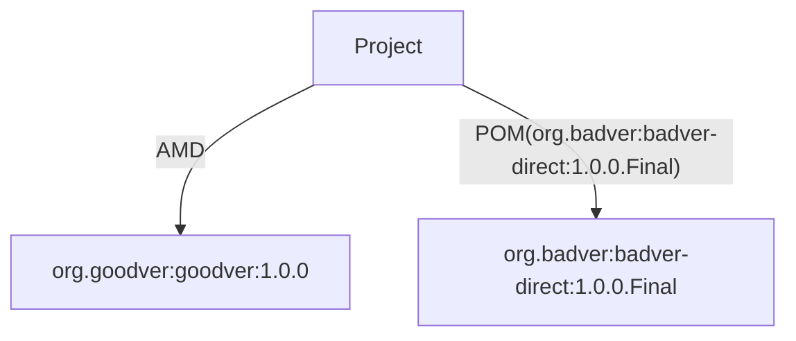

#### Step 6 - TRANSLATE

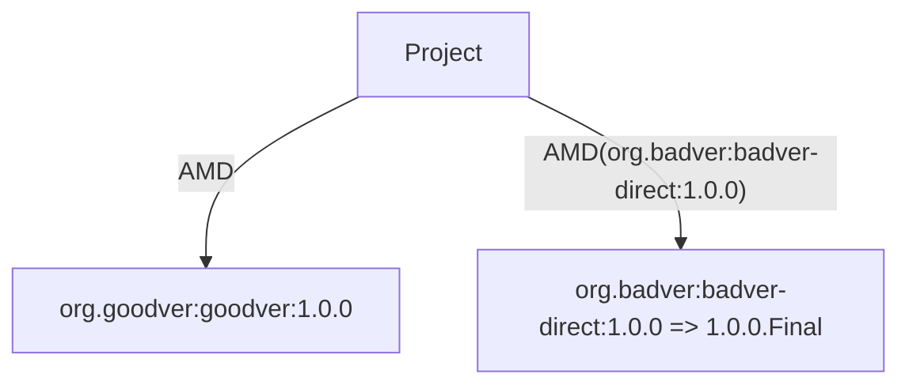

#### Step 7

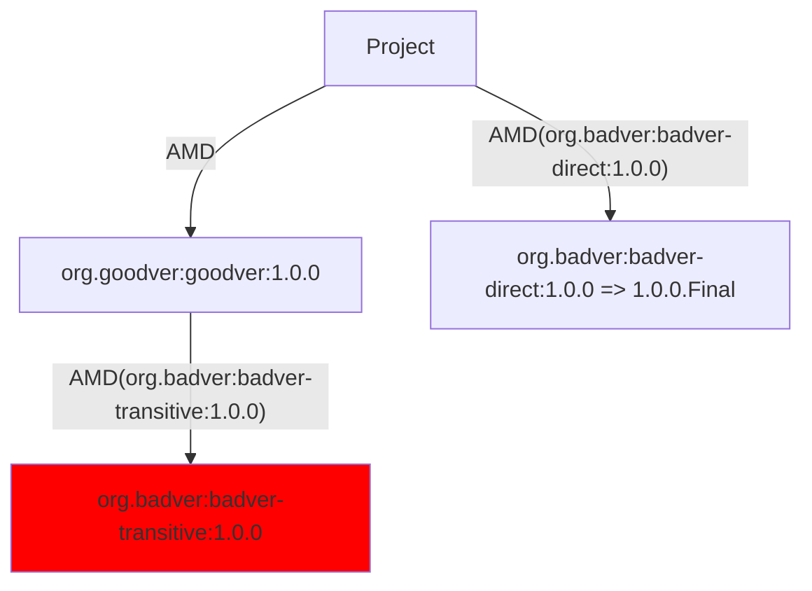

#### Step 8


#### Step 9

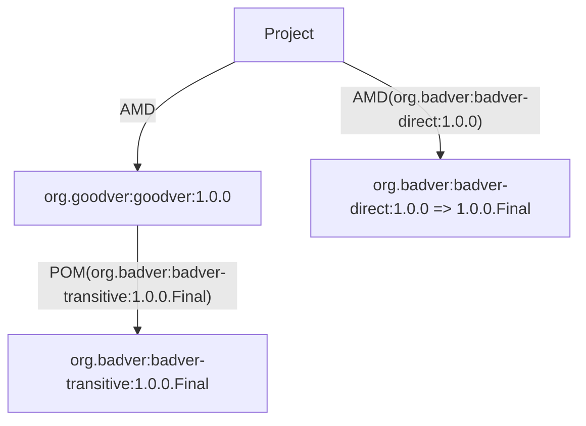

#### Step 10 - TRANSLATE

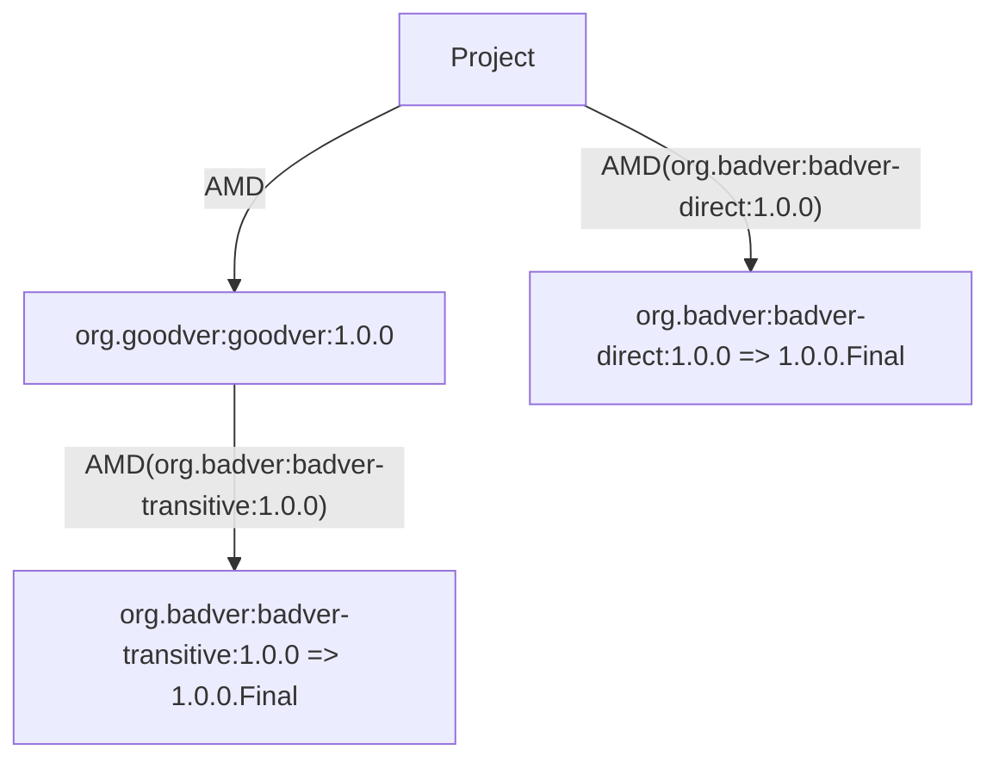

#### Step 11

The transitive POM should be cached locally now. It might even be in `~/.m2/repository` rather than `~/.savant/cache` so that Maven can use it as well. But we don't know it is there yet and need to follow the same pattern as above.


#### Step 12

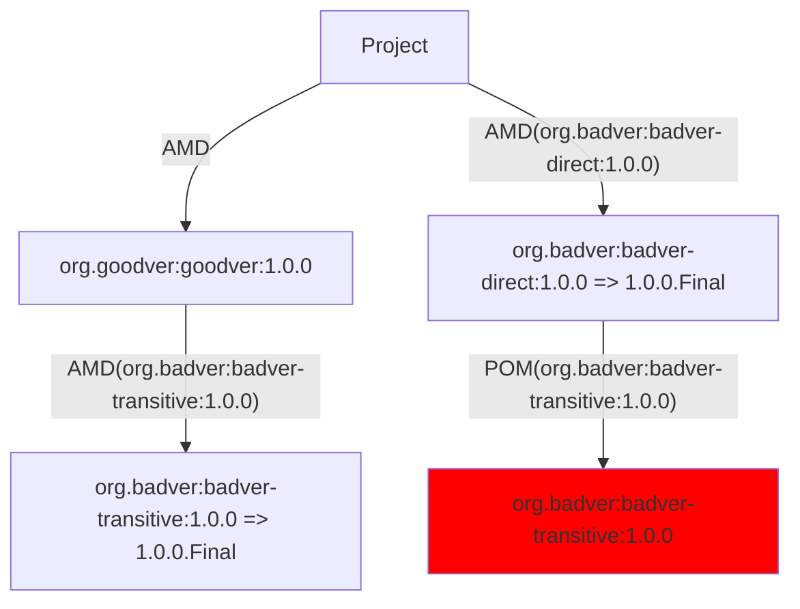

#### Step 13

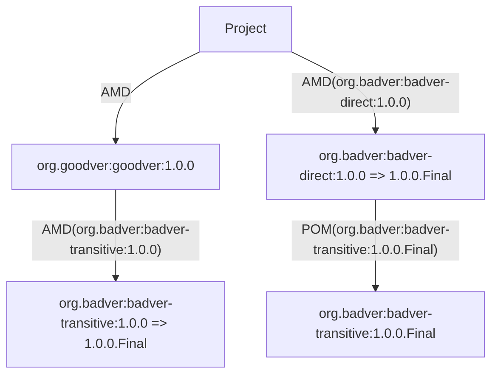

#### Step 14 - TRANSLATE

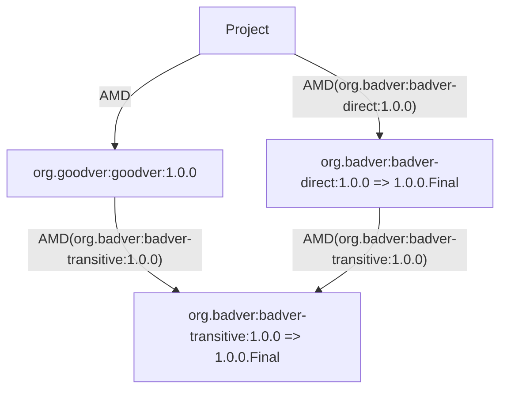

The process for this looks like this:

1. Update direct dependencies with bad versions on the `Artifact` object using the version mappings
2. Traverse to `org.goodver:goodver:1.0.0` and download AMD from Savant repository using Artifact
3. Traverse to `org.badver:badver-direct:1.0.0` and try to download AMD from Savant repository - FAILS
4. Change to `org.badver:badver-direct:1.0.0` and try to download POM from Maven repository - FAILS
5. Change to `org.badver:badver-direct:1.0.0.Final` and try to download POM from Maven repository - Success
6. Convert POM to AMD by looping over dependencies in POM and translating them. If any versions are not semantic, this process checks the version mappings to see if a better version exists. If one does, this creates an Artifact that has the correct version and the bad version.
7. Traverse to `org.badver:badver-transitive:1.0.0` and try to download AMD from Savant repository - FAILS
8. Change to `org.badver:badver-transitive:1.0.0` and try to download POM from Maven repository - FAILS
9. Change to `org.badver:badver-transitive:1.0.0.Final` and try to download POM from Maven repository - Success
10. Convert POM to AMD
11. Traverse again to `org.badver:badver-transitive:1.0.0` and try to download AMD from Savant repository - FAILS
12. Change to `org.badver:badver-transitive:1.0.0` and try to download POM from Maven repository - FAILS
13. Change to `org.badver:badver-transitive:1.0.0.Final` and try to download POM from Maven repository - Success
14. Convert POM to AMD

### Artifact fetch

The final Savant graph looks like this:

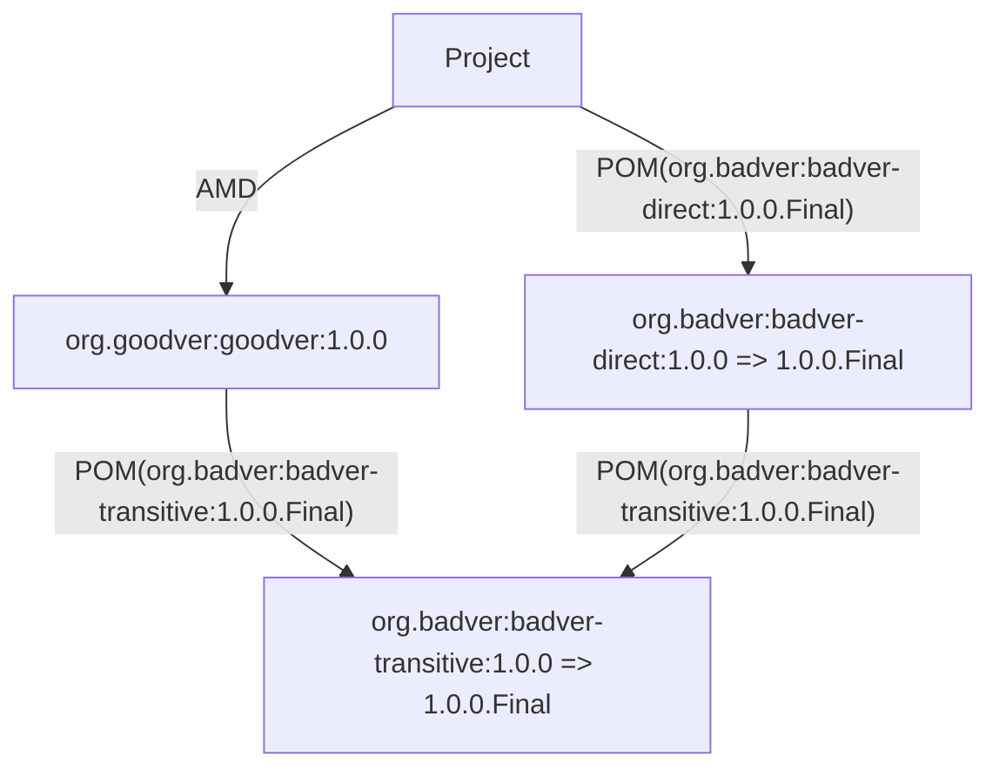

Whenever the nodes have bad versions, they are stored on the Artifact as metadata, not on the graph edges. This allows the graph to be SemVer compliant but the AMD/POM and artifact fetching to work with the bad versions as needed.

To fetch all the JARs, the process looks like this:

1. Traverse to `org.goodver:goodver:1.0.0` and download JAR from Savant repository using Artifact
2. Traverse to `org.badver:badver-direct:1.0.0` and try to download JAR from Savant repository - FAILS
3. Change to `org.badver:badver-direct:1.0.0` and try to download JAR from Maven repository - FAILS
4. Change to `org.badver:badver-direct:1.0.0.Final` and try to download JAR from Maven repository - Success
5. Traverse to `org.badver:badver-transitive:1.0.0` and try to download JAR from Savant repository - FAILS
6. Change to `org.badver:badver-transitive:1.0.0.Final` and try to download JAR from Savant repository - FAILS
7. Change to `org.badver:badver-transitive:1.0.0` and try to download JAR from Maven repository - FAILS
8. Change to `org.badver:badver-transitive:1.0.0.Final` and try to download JAR from Maven repository - Success

This process uses the `Process` objects as is and tries to use the different items using the different versions. The POM fetch is handled the same way.

The key here is that the `URLProcess` cannot ever handle Maven versions, so we can skip to the `MavenProcess`, which can handle them.
